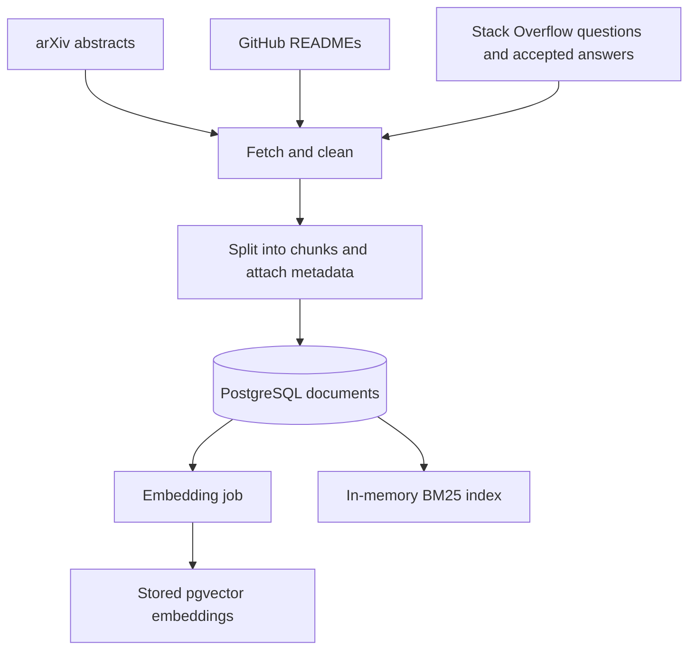
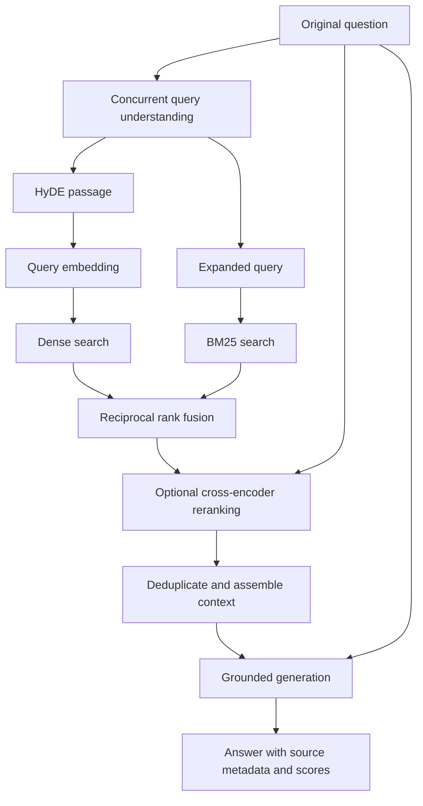

# DEVmind RAG: how the project works

Implementation guide through Day 14 · 11 September 2026

This document explains the code currently in this repository: what has been built, how the parts connect, why they exist, and what they do not guarantee. Implementation details come from the linked source files. Test results and corpus counts are recorded observations from the previous verification, not measurements taken every time this document is opened.

## Contents

> Sections 1–16 describe the Day 10 snapshot. Section 17 records Day 11, section 18 records Day 13, and section 19 records Day 14. These updates supersede earlier statements that citation checks, logging, evaluation, or an expansion toggle are still planned.

1. [What you have built](#1-what-you-have-built)
2. [Architecture and technology choices](#2-architecture-and-technology-choices)
3. [Database and document model](#3-database-and-document-model)
4. [Ingestion from the three sources](#4-ingestion-from-the-three-sources)
5. [Cleaning, chunking, and duplicates](#5-cleaning-chunking-and-duplicates)
6. [Generating and storing embeddings](#6-generating-and-storing-embeddings)
7. [Understanding the query: HyDE and expansion](#7-understanding-the-query-hyde-and-expansion)
8. [Retrieval: dense search, BM25, and fusion](#8-retrieval-dense-search-bm25-and-fusion)
9. [Reranking candidates](#9-reranking-candidates)
10. [Generation and context assembly](#10-generation-and-context-assembly)
11. [Following one question end to end](#11-following-one-question-end-to-end)
12. [API and local operation](#12-api-and-local-operation)
13. [Testing and observed results](#13-testing-and-observed-results)
14. [Performance, failures, and limitations](#14-performance-failures-and-limitations)
15. [Development milestones and next steps](#15-development-milestones-and-next-steps)
16. [Code map and project explanation](#16-code-map-and-project-explanation)
17. [Day 11 update: citation verification and faithfulness](#17-day-11-update-citation-verification-and-faithfulness)
18. [Day 13 update: experiments and metrics](#18-day-13-update-experiments-and-metrics)
19. [Day 14 update: Redis caching](#19-day-14-update-redis-caching)

## 1. What you have built

DEVmind is a technical question-answering backend. It collects information from arXiv abstracts, GitHub READMEs, and Stack Overflow questions with accepted answers. It stores that information locally, searches for passages relevant to a question, and asks a language model to produce an answer using those passages.

This is Retrieval-Augmented Generation, or RAG. There are three main stages:

| Stage | What it does | Why it is needed |
| --- | --- | --- |
| Ingestion | Fetches, cleans, splits, and stores source content | Creates the collection of knowledge the system can search |
| Retrieval | Finds and ranks chunks relevant to the current question | Selects a manageable amount of evidence for the model |
| Generation | Synthesizes an answer from that evidence | Turns search results into a usable response |

For example, a question about creating a pgvector index can retrieve SQL from the pgvector README. The generator can then explain that SQL and cite the chunk it used.

The system does not train or fine-tune its own language model. Embedding documents also does not train a model: it uses an existing model to represent text as vectors. The work you have implemented is the application pipeline around pretrained models, external data sources, and a local database.

A search engine returns passages. Your `/query` endpoint goes further and synthesizes them into an answer. The answer is intended to be grounded in the retrieved content, but grounding is currently enforced through instructions rather than an automated faithfulness evaluator.

## 2. Architecture and technology choices

There are two flows. Data preparation happens when ingestion and embedding jobs are triggered. Answering happens for each question.





The diagrams show the default enhanced path. Disabling HyDE makes dense search embed the original question. Disabling reranking leaves results ordered by fusion score.

| Technology | Actual role in this project | Practical reason for using it here |
| --- | --- | --- |
| FastAPI | HTTP routes, request validation, background job triggers | Provides a small Python API with interactive documentation |
| SQLAlchemy | Database sessions, queries, and the `Document` mapping | Keeps database access in Python objects and expressions |
| PostgreSQL | Persistent text, metadata, and vectors | Keeps the evidence and its vector representation together |
| pgvector | `Vector(1536)` storage and cosine-distance operations | Enables semantic search inside PostgreSQL |
| OpenAI embeddings | `text-embedding-3-small` for stored and query vectors | Represents differently worded passages in a comparable vector space |
| `rank_bm25` | Local `BM25Okapi` keyword ranking | Adds lexical matching alongside semantic similarity |
| Sentence Transformers | Runs the cross-encoder locally | Re-evaluates query–passage relevance after initial retrieval |
| `gpt-4o-mini` | HyDE, expansion, and final answer generation | Uses one configured chat model for three distinct text tasks |
| `tiktoken` | Measures generation-context length in tokens | Applies the requested 800-token/600-token trimming rule |
| Docker Compose | Runs PostgreSQL with pgvector | Makes local database startup repeatable |

These are explanations of the design's purpose, not claims that every choice has been benchmarked against alternatives.

## 3. Database and document model

Code: [models.py](../app/models.py), [database.py](../app/database.py), [docker-compose.yml](../docker-compose.yml).

All sources share one `documents` table. Despite the name, a row represents a searchable chunk, not necessarily a complete paper, repository, or question thread.

| Field | Meaning |
| --- | --- |
| `id` | Unique database row ID |
| `content` | Text used for embedding, keyword retrieval, and generation context |
| `domain` | `arxiv`, `github`, or `stackoverflow` |
| `source_url` | Link to the original source |
| `metadata` | JSONB containing source-specific details |
| `embedding` | Nullable vector with 1,536 dimensions |
| `chunk_index` | Position of this chunk within its parent source |
| `parent_doc_id` | Identifier linking chunks to their original source |
| `created_at` | Database insertion timestamp |

The Python attribute is named `metadata_`, while the database column is `metadata`. This avoids the name used by SQLAlchemy's declarative machinery.

A single table lets the retriever search all three sources through the same interface. JSONB allows each source to retain its own metadata without needing an identical schema: an arXiv record has authors, while a repository record has stars and a section title.

`parent_doc_id` has two uses. In ingestion it helps skip sources already stored. In generation it helps prevent multiple chunks from one source consuming the context. Parent IDs are interpreted together with the source domain.

The database URL comes from `.env`, with a local fallback on port `5433`. Docker maps host port `5433` to PostgreSQL port `5432` inside the container. The named `postgres_data` volume persists database contents across container restarts.

At API startup, the application ensures the vector extension and tables exist, then builds BM25 from the stored content. This is basic initialization, not a database migration system. `create_all` does not migrate an existing table when its definition changes.

## 4. Ingestion from the three sources

Ingestion creates the evidence collection. Each source has a fetcher, source-specific conversion logic, duplicate checks, and a background-job wrapper with its own database session.

### 4.1 arXiv

Code: [arxiv_ingester.py](../app/ingestion/arxiv_ingester.py).

The ingester searches ten configured topics, requesting up to 50 results per topic in relevance order. Topics include RAG, large language models, transformer architecture, embeddings, neural information retrieval, and prompt engineering.

For each result it:

1. Extracts the arXiv identifier from the entry URL.
2. Checks whether that identifier already exists under the `arxiv` domain.
3. Cleans the abstract from `result.summary`.
4. Stores the title, up to five authors, publication timestamp, categories, identifier, and PDF URL as metadata.
5. Splits the abstract if needed and stores the resulting chunks.
6. Commits after each topic's batch.

The arXiv client is configured with a page size of 100, a three-second delay, and three retries. The total fetched count can include the same paper appearing in multiple topic searches; duplicate checks prevent ordinary sequential runs from inserting it again.

**What the corpus contains:** abstracts, not full PDFs. A stored PDF URL is a reference, not evidence that the PDF has been parsed. This matters for technical questions: an abstract may explain a paper's contribution without containing its equations or implementation details.

Version suffixes remain part of the extracted identifier. The code does not normalize all versions of a paper into one logical record.

### 4.2 GitHub

Code: [github_ingester.py](../app/ingestion/github_ingester.py).

The ingester visits a fixed list of 20 repositories. Examples include pgvector, PyTorch, Transformers, FAISS, LangChain, Qdrant, and vLLM. It does not crawl all GitHub repositories or index their entire source trees.

For each repository it:

1. Checks whether the repository name is already stored under `github`.
2. Fetches repository metadata using GitHub's REST API.
3. Fetches the README and decodes its Base64 content as UTF-8.
4. Cleans the Markdown.
5. Splits the README by heading, then splits long sections into smaller chunks.
6. Saves each chunk with its repository name, section title, stars, description, and repository URL.
7. Commits the repository's chunks and applies a short delay between processed repositories.

The code requires `GITHUB_TOKEN`, uses a 15-second request timeout, and sleeps 0.5 seconds between successfully processed repositories. Non-200 responses are logged and skipped. Network exceptions can still interrupt the job; comprehensive retry and rate-limit recovery are not implemented.

READMEs are valuable for installation commands, API examples, and configuration. However, repository metadata such as stars is not used as a ranking boost. The stored URL points to the repository, not necessarily an exact README section or immutable commit.

### 4.3 Stack Overflow

Code: [stackoverflow_ingester.py](../app/ingestion/stackoverflow_ingester.py).

The ingester requests the top 25 questions by votes for each of eight tags:

`python`, `machine-learning`, `nlp`, `pytorch`, `transformers`, `vector-database`, `langchain`, and `openai-api`.

It requests question bodies, gathers accepted-answer IDs, then fetches those answers in a separate API call. It only stores threads with a question body and a matching accepted answer with content.

The stored text follows this structure:

```text
Question: <title>

<question body>

Answer:
<accepted answer body>
```

Keeping the question with its answer supplies context: an answer such as “reduce the batch size” is more useful when the system also knows the original error or scenario.

Metadata includes question and accepted-answer IDs, score, views, tags, creation date, answer count, and the question link. The parent ID is the question ID converted to a string. Long threads are split before insertion.

The client uses a 20-second timeout, logs remaining API quota, and honors returned backoff delays. An API key is optional. The implementation fetches one question page per tag; it is not an exhaustive historical crawler.

An accepted answer is a selection criterion, not a correctness guarantee. It may be outdated or contain inaccurate advice. Grounding an answer in such a source does not repair the source itself.

### 4.4 What happens when an ingestion job ends

Each `run_*_ingestion` wrapper rolls back outstanding uncommitted work, rebuilds BM25, and closes the session. The rebuild also runs after a failure so batches committed before that failure can become searchable.

Rollback does not undo earlier committed batches. This makes partial progress possible, but there is no persistent job record, progress endpoint, or automatic resume coordinator. The HTTP trigger returns a start message; the actual result is reported through logs.

## 5. Cleaning, chunking, and duplicates

Code: [cleaner.py](../app/ingestion/cleaner.py), [chunker.py](../app/ingestion/chunker.py).

### Cleaning

Cleaning reduces formatting noise before retrieval:

| Source | Current cleaning behavior | Tradeoff |
| --- | --- | --- |
| arXiv | Removes matched inline math/LaTeX patterns, collapses whitespace, removes non-ASCII characters | Can discard meaningful formulas, symbols, or names |
| GitHub | Removes matched remote Markdown images, HTML comments, standalone HTTP links, and excess blank lines | Some HTML and Markdown formatting remains |
| Stack Overflow | Extracts text from HTML, adds separation around preformatted blocks, marks inline code with backticks | Whitespace normalization can damage code indentation |

These are small text transformations, not complete parsers or security sanitizers. In particular, useful technical details can be lost during cleaning.

### Why split content into chunks?

A long README may discuss installation, indexing, deployment, and troubleshooting. A single vector for the whole file would mix all those topics. Smaller chunks give the retriever a more focused unit to rank and the generator less unrelated text to read.

The current generic splitter uses:

- A maximum of **1,800 characters** per chunk.
- **200 characters of overlap** before whitespace trimming.
- A space boundary in the latter half of the window when one is available.
- A fixed character boundary when no suitable space is found.

Overlap preserves some neighboring context when a useful explanation crosses a boundary. It also stores repeated text, which is part of the cost of this simple approach.

GitHub has a structural pass first: headings separate sections, while headings inside triple-backtick code blocks are ignored. Long sections are then split by the generic splitter. Section metadata is copied to the resulting chunks, although the repository/title prefix is not repeated in every continuation chunk's content.

This is not token-based ingestion, semantic segmentation, or a complete Markdown parser. It can split sentences and code blocks. It also does not maintain a full hierarchy of parent headings.

### Two different kinds of deduplication

**Ingestion deduplication** checks whether a parent source is already present in its domain. It avoids inserting an entire known source again during normal sequential use. It does not compare content hashes or refresh changed sources.

**Generation deduplication** keeps only the highest-ranked chunk per parent source among the retrieved results. It reduces repetitive context but can discard different, useful sections from the same repository.

There is no database uniqueness constraint enforcing one row per `(domain, parent_doc_id, chunk_index)`. Overlapping ingestion jobs can race. For now, run jobs sequentially.

The revised chunking applies only to newly ingested sources. Previously stored rows were not rewritten, and the duplicate checks mean rerunning ingestion does not automatically rechunk them.

## 6. Generating and storing embeddings

Code: [embeddings.py](../app/embeddings.py), [embedder.py](../app/ingestion/embedder.py).

An embedding is a list of numbers representing a text passage. The project uses `text-embedding-3-small`, with the resulting 1,536-dimensional vectors stored in `Vector(1536)`.

The same embedding model is used for document chunks and search input. That consistency lets the database compare them in the same vector space. The sentence-transformers model used later is a reranker; it does not generate the stored document vectors.

Embedding is separate from fetching. Calling an ingestion endpoint stores text with `embedding=None`. Calling `/embed` processes pending rows:

1. Select up to 50 rows whose embedding is null, ordered by ID.
2. Send their content to the embedding API in one batch.
3. Sort returned embedding objects by their input index and check that they match the requested batch.
4. Assign vectors to the corresponding rows.
5. Commit the batch and repeat until there are no pending rows.

On a batch failure, the transaction is rolled back, the error is logged, and the job raises the exception. Previously committed batches remain saved. Running the job again selects the remaining null embeddings.

The client rejects blank input and no longer silently truncates long content. This avoids creating an embedding for only the beginning of a stored passage while pretending the entire passage was represented. Older oversized rows can still require manual rechunking.

Why keep embedding separate? Fetching and model calls have different failure modes and costs. Separating them lets you inspect collected text first and retry embedding without fetching all sources again.

## 7. Understanding the query: HyDE and expansion

Code: [query_understanding.py](../app/retrieval/query_understanding.py).

The query-understanding layer returns an `EnhancedQuery` object:

| Field | Used for |
| --- | --- |
| `original_query` | Original intent and debugging |
| `hyde_passage` | Dense-search embedding input |
| `expanded_query` | BM25 keyword input |

### HyDE

HyDE means Hypothetical Document Embeddings. Instead of embedding only a short question, the system asks `gpt-4o-mini` to write a relevant technical passage and embeds that passage.

For a question such as “why do transformers struggle with long sequences,” a hypothetical passage might mention attention matrices, memory complexity, and long-range dependencies. Those concepts may resemble language used in relevant documents.

This is a retrieval hypothesis, not retrieved evidence. The hypothetical passage is never included in the generation context as a source. It is exposed as `hyde_query` for debugging.

The prompt requests 150–200 words of technical prose, no citations, headings, code blocks, or Q&A format. The call uses temperature zero and a 400-token output budget. The code performs basic format checks, but it does not strictly count and enforce the requested word range or verify the passage's factual accuracy.

HyDE can help conceptual queries. It can also steer retrieval in the wrong direction if the hypothetical passage assumes the wrong technology, syntax, or explanation. Its benefit is something to evaluate, not an automatic guarantee.

### Query expansion

Expansion asks the same model for 4–8 related terms in a single comma-separated line, using a 120-token output budget. The code tokenizes that output, removes terms already present in the original query and repeated additions, and appends new tokens to the original query.

Illustrative transformation:

```text
Original: attention transformer
Expanded: attention transformer mechanism self multi head context vectors
```

This example describes the shape of the transformation, not a fixed model response. The goal is to increase possible keyword matches without replacing the user's original terms.

This implementation makes **one expanded BM25 query**. It does not generate several independent searches and fuse those separate result lists. Expansion adds terminology; rewriting more generally changes phrasing. HyDE serves a different purpose by producing document-like embedding input.

### Concurrency and fallback

When HyDE is enabled, `asyncio.gather` runs HyDE and expansion concurrently. Their network waits can overlap. Each call owns and closes its own async client, with a ten-second SDK timeout and no automatic retries.

Each enhancement catches ordinary failures independently and returns the original query. A failed HyDE call therefore does not discard a successful expansion, and vice versa.

The FastAPI search and query routes are synchronous functions executed in worker threads. They bridge into async query understanding with `asyncio.run`. The rest of the pipeline uses synchronous database/model calls. This is targeted concurrency, not an entirely async application.

`hyde=false` on `/search/hybrid`, or `use_hyde=false` on `/query`, disables only HyDE. Expansion still runs. There is currently no public flag to turn expansion off in hybrid search. `/search/bm25` uses the original query directly and does not call the query-understanding layer.

## 8. Retrieval: dense search, BM25, and fusion

Code: [dense.py](../app/retrieval/dense.py), [bm25_index.py](../app/retrieval/bm25_index.py), [tokenizer.py](../app/retrieval/tokenizer.py), [hybrid.py](../app/retrieval/hybrid.py).

### Dense search: similarity in meaning

Dense search compares the query embedding to stored embeddings using cosine distance. Conceptually:

```text
cosine similarity = dot(query_vector, document_vector)
                    / (length(query_vector) × length(document_vector))

cosine distance = 1 − cosine similarity
```

Smaller distance ranks first. The query excludes rows with null embeddings, preventing an unembedded row from reaching the `float(distance)` conversion.

The return value is a list of `(document_id, distance)` pairs. This is a similarity-based ordering, not a probability that a document contains a correct answer.

The repository defines no HNSW or IVFFlat database index. It uses pgvector distance queries, but you should not describe it as an implemented approximate-nearest-neighbor index. The generated answer may explain how to create such an index from a README; that does not mean the application itself has created one.

### BM25: matching actual terms

BM25 scores token overlap while accounting for term frequency, document frequency, and document length. It provides another signal when terminology matters, such as a library name or an error message.

The current tokenizer lowercases text, replaces characters outside `\w` and whitespace with spaces, and splits on whitespace. It does not stem words, remove stopwords, or preserve all code operators. For example, punctuation-heavy strings such as `<=>` lose their distinctive symbols.

`build_index` reads document IDs and content, skips chunks with no tokens, and creates an in-memory `BM25Okapi` model. The model and matching ID tuple are swapped together so a search uses one consistent snapshot during a rebuild.

The index rebuilds at startup and when ingestion wrappers finish. It does not require stored vectors. Search sorts BM25 scores and returns only positive-scoring results, so it can return fewer than the requested `k` even when some terms occur in the corpus.

BM25 is process-local. This is why the documented local setup uses one API worker. Refreshing one worker's index would not refresh every other worker's index.

### Why combine them?

Dense search may find relevant text with different wording. BM25 may find important literal terms that semantic similarity underweights. Their weaknesses are different, so the project combines their result rankings.

It does not directly add a BM25 score to a cosine distance. Those numbers use different scales and opposite ranking directions. Instead it uses Reciprocal Rank Fusion, or RRF.

For each document:

```text
RRF score = sum of 1 / (60 + rank) across result lists containing the document
```

Rank starts at 1. A document ranked first in dense search and third in BM25 gets:

```text
1 / 61 + 1 / 63 ≈ 0.03227
```

A document appearing only first in one list gets about `0.01639`. Shared high-ranking results receive support from both lists. Raw similarity values are discarded during this fusion.

### Exact candidate flow

With reranking enabled, `fetch_k = max(20, k)`. With reranking disabled, `fetch_k = k`.

For the default request for five reranked results:

1. Fetch up to 20 dense results.
2. Fetch up to 20 BM25 results.
3. Fuse the lists; there may be up to 40 distinct candidate IDs.
4. Keep the top 20 fused candidates.
5. Load those documents and rerank them.
6. Return up to five results.

Without reranking, a default five-result request fetches up to five from each retriever, fuses them, and returns up to five by RRF score.

There is no source quota or routing rule: a query can return all GitHub or all arXiv results. Stars, votes, publication date, and source domain are stored metadata, not explicit ranking weights.

## 9. Reranking candidates

Code: [reranker.py](../app/retrieval/reranker.py).

The reranker uses `cross-encoder/ms-marco-MiniLM-L-6-v2`, loaded locally through Sentence Transformers. It receives pairs:

```text
[original question, candidate chunk content]
```

An embedding model represents texts independently so many stored vectors can be searched efficiently. A cross-encoder reads the question and candidate together, allowing a more direct relevance comparison. Running that on every chunk would be more expensive, so it is applied only after candidate retrieval.

The configured maximum combined sequence length is 512 model tokens. Long query–passage pairs can be truncated internally. This differs from the later generation-context trimming, which uses a different model's tokenizer and budget.

The reranker returns `(document, rrf_score, reranker_score)` triples sorted by reranker score, descending. Without reranking, hybrid search returns `(document, rrf_score)` pairs.

Reranker scores can be negative and are not calibrated confidence percentages. A larger score indicates higher ranking in that model's output; it does not establish that the document is true or sufficient to answer.

The model loads on first use and is cached in the process. This reduces repeated initialization, but the first reranked request can be slow. The model cannot rescue a relevant chunk that was not included in its candidate set.

## 10. Generation and context assembly

Code: [generator.py](../app/generation/generator.py).

`generate_answer` is the top-level orchestration function. It runs query understanding, calls hybrid retrieval, assembles context, generates the answer, and returns structured metadata.

It passes the already-created `EnhancedQuery` into `search_hybrid`. This avoids generating HyDE and expansion twice for the same `/query` request.

### Building the evidence context

`assemble_context` sorts retrieved chunks by reranker score, or RRF score when reranking is disabled. It then:

1. Skips blank content.
2. Keeps the first result for each `(domain, parent_doc_id)` pair, using row ID when the parent is missing.
3. Counts tokens with the generator model's `tiktoken` encoding.
4. Keeps the text unchanged when it has at most 800 tokens.
5. Uses only the first 600 tokens when it exceeds 800 tokens.
6. Assigns sequential source numbers and creates source metadata.
7. Stops at five sources.

The response contains the exact text supplied as context, including any trimming. The full stored row is not modified.

Because deduplication happens after retrieval has returned five chunks, fewer than five sources can remain. The generator does not go back for replacement chunks. If all five came from pgvector's README, only one survives, even if the sections cover different topics.

Titles come from stored title metadata, repository plus section name, the first `Question:` line of a Stack Overflow chunk, or a parent/row identifier fallback. Some continuation chunks may not contain the original question title, so their display title can be less descriptive.

### Prompt structure

The system prompt requires the model to answer only from the context, preserve qualifications, cite supported claims as `[Source N]`, and state when evidence is insufficient. It also tells the model to treat the retrieved text as untrusted reference material rather than instructions.

The user message has this structure:

```text
Context:
[Source 1: github - pgvector/pgvector — IVFFlat]
<retrieved chunk text>

[Source 2: stackoverflow - example question title]
<retrieved chunk text>

Question: <original question>

Answer (cite sources inline using [Source N] notation):
```

The hypothetical HyDE passage is not included here. Allowing a generated hypothesis to serve as source evidence would undermine the reason for retrieving real documents.

### Model output versus API response

The generation call uses `gpt-4o-mini`, temperature zero, up to 700 completion tokens, a 20-second SDK timeout, and no automatic retries. It is non-streaming.

The model is constrained with a strict JSON schema to produce only:

```json
{"answer": "An answer with inline [Source 1] citations."}
```

The server supplies the rest of the response. It does not ask the model to invent URLs, document IDs, scores, or elapsed time.

| Response field | Where it comes from |
| --- | --- |
| `answer` | Validated model output, or the no-context fallback |
| `sources` | Actual selected database chunks with source numbers and display metadata |
| `query` | Validated original question |
| `hyde_query` | Text actually chosen for dense embedding; the original query when disabled or on fallback |
| `retrieval_scores` | Scores associated with each selected source number |
| `latency_ms` | Server-side elapsed time across the pipeline |

Each source contains `source_id`, `document_id`, `domain`, `title`, `source_url`, and `content`. Each score entry contains `source_id`, `rrf_score`, and `reranker_score`. The latter is `null` if reranking was disabled.

All context sources are returned, not just the sources cited by the answer. These lists explain what the model could use; they do not prove what influenced each sentence.

### Insufficient information and invalid outputs

If context assembly produces no sources, the system skips the generation call and returns:

> The retrieved sources don't contain enough information to answer this question.

If there are sources but they do not answer the question, the prompt asks the model to acknowledge that gap or give a clearly limited partial answer. There is no implemented relevance threshold that automatically rejects weak but nonempty retrieval.

The code rejects missing choices, refusals, incomplete completions, invalid JSON, and blank answers. These are structural checks. It does not yet check that every citation number exists or that each claim follows from the cited source.

A correct JSON schema is not a truth check. A valid source number is not a faithfulness check. Both distinctions matter for the planned Day 11 work.

## 11. Following one question end to end

Consider:

```text
How do I create a vector index in pgvector?
```

1. The client sends the question to `POST /query`.
2. Pydantic validates the body and strips surrounding whitespace.
3. HyDE and expansion run concurrently. HyDE supplies document-like dense input; expansion supplies extra BM25 terms.
4. The embedding client turns the selected dense input into a vector.
5. PostgreSQL returns similar embedded chunks. BM25 independently returns lexical matches.
6. RRF merges their rankings.
7. The cross-encoder scores the top fused candidates against the original question.
8. Context assembly orders the top five results and removes repeated parents.
9. The model receives the original question and selected source text, such as the README's IVFFlat examples.
10. The model writes a cited answer. The server attaches actual source metadata and scores.
11. The client receives one JSON object with the answer and total latency.

In the recorded live test, this query produced SQL supported by the pgvector README. Deduplication left one context source. That is an observed example, not a promise that every run returns the same chunk or wording.

Neither retrieval nor generation executes that SQL. The system returns text; it does not grant the generator tools to run commands or change the database.

## 12. API and local operation

Code: [main.py](../app/main.py).

| Endpoint | Main behavior |
| --- | --- |
| `GET /health` | Returns a basic `status: ok`; not a dependency readiness test |
| `POST /ingest/arxiv` | Starts the arXiv background ingestion job |
| `POST /ingest/github` | Starts the README background ingestion job |
| `POST /ingest/stackoverflow` | Starts the Stack Overflow background ingestion job |
| `POST /embed` | Starts embedding pending chunks |
| `GET /search/bm25` | Original-query keyword search |
| `GET /search/hybrid` | Dense + expanded BM25 retrieval, optional HyDE and reranking |
| `POST /query` | Complete retrieval-to-answer pipeline |
| `GET /stats` | Counts rows by domain and embedding status |

Search routes accept `query` and `k`. Query text must be nonblank and at most 2,000 characters. `k` must be 1–100 and defaults to 5. `/search/hybrid` uses `hyde` and `rerank` flags, both defaulting to true.

`POST /query` accepts a JSON body with `query`, `use_hyde`, and `use_reranking`. Both flags default to true. Unknown fields are rejected. The endpoint uses a fixed retrieval count of five; it does not expose `k`.

For `/query`, invalid request bodies return 422, model timeouts that reach the endpoint return 504, and other caught model API or generation-format errors return 502. Query enhancement failures usually fall back internally instead. Database failures and other unexpected exceptions are not covered by this specific API-error mapping.

### Start locally

From the repository root:

```bash
source .venv/bin/activate
pip install -r requirements.txt
# Start Docker Desktop before the next command.
docker compose up -d
uvicorn app.main:app --reload --port 8001
```

For a fresh clone, create the virtual environment first with `python -m venv .venv`. Configure `DATABASE_URL`, `OPENAI_API_KEY`, and `GITHUB_TOKEN` in `.env`; `STACKEXCHANGE_API_KEY` is optional. Do not put real API keys in documentation or Git.

Open `http://localhost:8001/docs` for the interactive API. Check `http://localhost:8001/stats` before deciding whether ingestion or embedding is needed. For an existing embedded corpus, you can query immediately.

For a new corpus, trigger each ingestion job, wait for its completion in logs, then run `/embed`. Avoid starting overlapping jobs. After embedding completes, `/stats` should report zero pending embeddings if all batches succeeded.

```bash
curl -X POST http://localhost:8001/query \
  -H 'Content-Type: application/json' \
  -d '{"query":"how do I create a vector index in pgvector"}'
```

To compare without HyDE:

```bash
curl -X POST http://localhost:8001/query \
  -H 'Content-Type: application/json' \
  -d '{"query":"how do I create a vector index in pgvector","use_hyde":false}'
```

This comparison still uses expansion. Changing both HyDE and reranking at once makes it harder to identify which change affected the result.

## 13. Testing and observed results

Code: [test_pipeline.py](../tests/test_pipeline.py), [test_generation.py](../tests/test_generation.py).

The last completed verification reported **31 passing tests**. Run them with:

```bash
python -m unittest discover -s tests -v
```

The suite uses fixtures and mocks for external model calls and database behavior. It does not require a live PostgreSQL database or paid OpenAI requests. `tiktoken` may need to fetch its tokenizer data on first use if it is not cached.

Coverage includes result counts, request validation, null-vector filtering in generated SQL, BM25 rebuilds and empty content, RRF ordering, chunk bounds and provenance, embedding commits and rollback behavior, enhancement concurrency and fallbacks, correct query routing, context deduplication, token trimming, source titles, generation response validation, and HTTP error handling.

Passing these tests does not establish retrieval quality over an arbitrary corpus. It establishes selected behaviors under controlled inputs.

### Recorded corpus snapshot

| Domain | Stored rows | Embedded rows |
| --- | ---: | ---: |
| arXiv | 491 | 491 |
| GitHub | 375 | 375 |
| Stack Overflow | 118 | 118 |
| **Total** | **984** | **984** |

These are chunk counts from the earlier live check, not counts of unique parent sources. The snapshot included previously ingested rows that were not migrated to the newer chunk size.

### Day 10 live checks

| Question | Observed behavior |
| --- | --- |
| How does multi-head attention work? | Cited arXiv but acknowledged the abstracts lacked a detailed mechanism explanation |
| How do I fix CUDA out of memory in PyTorch? | Used a Stack Overflow troubleshooting thread |
| How do I create a vector index in pgvector? | Returned IVFFlat SQL supported by the README |
| What is retrieval augmented generation? | Used arXiv abstracts discussing RAG |
| What are the limitations of transformer attention for long sequences? | Used arXiv discussion of memory and computation costs |

All five returned HTTP 200. Their inline citation numbers matched returned source numbers, and the cited passages were manually inspected. The multi-head attention response did not supply the hoped-for query/key/value explanation because the selected sources lacked it. That exposes a retrieval/corpus gap rather than a reason to fill the answer from unprovided knowledge.

The checks were smoke tests, not a scored benchmark. They did not measure Recall@k, MRR, NDCG, aggregate faithfulness, or a statistically reliable HyDE improvement. Different results with HyDE on and off show that the path affects retrieval, not that it is always better.

## 14. Performance, failures, and limitations

### Where the time and cost go

A normal `/query` with HyDE enabled makes four external model requests: one HyDE call, one expansion call, one embedding call, and one final-generation call. The first two overlap. Reranking runs locally. Disabling HyDE removes one external call, not all query enhancement.

Approximate successful-request structure:

```text
total time ≈ max(HyDE, expansion)
           + query embedding
           + local retrieval and fusion
           + local reranking
           + context assembly
           + answer generation
```

Database and text-processing costs also contribute. A no-source result skips the final generation call, but enhancement and query embedding have already run.

In the five-query smoke run, the first request took about **20.5 seconds**, and subsequent requests took **4–6 seconds**. A later instrumented run measured approximately:

| Stage | Time |
| --- | ---: |
| Query understanding | 3,010 ms |
| Query embedding | 709 ms |
| Local search and document loading | 45 ms |
| Reranking | 279 ms |
| Context assembly | 105 ms |
| Generation and remaining response work | 1,706 ms |
| **Total** | **5,854 ms** |

The embedding/search/reranking figures are subdivisions of the 1,033 ms retrieval stage; they should not be counted twice. These are individual local observations, not throughput measurements or an SLA. The first request can additionally include model/tokenizer initialization. The exact cause of every part of the 20.5-second first request was not isolated.

The under-five-second target is not consistently met. A request over eight seconds does not prove concurrency is broken; API latency, initialization, and generation length can also cause it.

### Existing safeguards and their boundaries

| Situation | Current behavior | Remaining limitation |
| --- | --- | --- |
| Missing document vectors | Dense search excludes them | BM25 can still retrieve the unembedded text |
| Enhancement failure | Falls back to original query for that branch | Logs are needed to notice degraded enhancement |
| Failed embedding batch | Rollback, log, raise | No durable scheduler retries it automatically |
| Blank or invalid input | Request rejected | No authentication or rate limiting is implemented |
| Empty generation context | Explicit insufficient-information answer | Weak but nonempty context is not automatically rejected |
| Invalid model JSON/refusal | Generation error mapped by `/query` | Structural validity does not establish truth |
| New ingestion | BM25 rebuild after the wrapper finishes | No cross-worker index synchronization |
| Malicious source instructions | Prompt says to treat context as untrusted | Prompt-only separation is not a complete injection defense |

### Limits worth explaining accurately

- The corpus is deliberately small and selected: abstracts, fixed READMEs, and one page of questions per tag.
- Sources are not automatically refreshed. Parent-ID skipping can preserve outdated content.
- Ingestion cleaning and character splitting can lose formulas, indentation, or context.
- No database uniqueness constraint prevents concurrent duplicate insertion.
- No approximate vector index is declared in the repository, and no retrieval benchmark establishes scale limits.
- BM25 scans scores locally, strips technical punctuation, and drops nonpositive results.
- Reranking only sees retrieved candidates and may truncate long pairs.
- Parent deduplication can remove complementary sections from one repository without backfilling context.
- A grounded answer can repeat an error in its source. Source correctness and answer faithfulness are different questions.
- Automatic citation validation, claim verification, and faithfulness scoring are not implemented yet.
- API jobs run in the process, with no durable queue or persistent job status. A server restart interrupts them.
- The API is non-streaming and has no frontend, conversation memory, or conversation history store.
- There is no production authentication, authorization, rate limiting, or comprehensive monitoring stack.

These are descriptions of the current scope, not changes made by this document.

## 15. Development milestones and next steps

The project started with ingestion and retrieval. Review and testing then identified concrete reliability problems, followed by query enhancement and generation work.

| Milestone | Implemented work |
| --- | --- |
| Ingestion and embeddings | Three source ingesters, shared document storage, background embedding batches |
| Retrieval | Dense similarity, BM25, RRF fusion, and cross-encoder reranking |
| Reliability fixes | Correct `k` handling, null-vector exclusion, BM25 refresh and empty-corpus handling, bounded chunks, safer embedding failures, query validation, lazy model loading, and source metadata in responses |
| Day 9 | Concurrent HyDE and query expansion, independent fallbacks, toggle and debugging logs |
| Day 10 | Context assembly, grounded generation, structured `/query` response, stage timings, and tests |

The changes were pushed to GitHub in four commits:

- [993eb51 — ingestion and embedding fixes](https://github.com/rid325/DEVmind-RAG/commit/993eb51)
- [c29f488 — hybrid retrieval and HyDE expansion](https://github.com/rid325/DEVmind-RAG/commit/c29f488)
- [06aa205 — grounded query endpoint](https://github.com/rid325/DEVmind-RAG/commit/06aa205)
- [571a600 — setup documentation and cleanup](https://github.com/rid325/DEVmind-RAG/commit/571a600)

The planned Day 11 work is source-attribution hardening: check that inline references resolve to real sources, and assess whether the cited text supports the answer. The later evaluation harness should compare configurations using labelled questions and relevant-source expectations. Streaming and a frontend are later enhancements, not prerequisites for the current endpoint to work.

## 16. Code map and project explanation

| File | Responsibility |
| --- | --- |
| [app/main.py](../app/main.py) | Startup, API routes, request dependencies, and `/query` error mapping |
| [app/database.py](../app/database.py) | Engine, declarative base, session factory, request session cleanup |
| [app/models.py](../app/models.py) | Shared document schema |
| [app/embeddings.py](../app/embeddings.py) | Cached OpenAI client and embedding API helper |
| [app/ingestion/arxiv_ingester.py](../app/ingestion/arxiv_ingester.py) | arXiv fetching, conversion, and ingestion |
| [app/ingestion/github_ingester.py](../app/ingestion/github_ingester.py) | Repository/README fetching and ingestion |
| [app/ingestion/stackoverflow_ingester.py](../app/ingestion/stackoverflow_ingester.py) | Questions, accepted-answer fetching, and ingestion |
| [app/ingestion/cleaner.py](../app/ingestion/cleaner.py) | Source-specific text cleanup |
| [app/ingestion/chunker.py](../app/ingestion/chunker.py) | Character splitting, overlap, and README sections |
| [app/ingestion/embedder.py](../app/ingestion/embedder.py) | Pending-row embedding batches |
| [app/retrieval/query_understanding.py](../app/retrieval/query_understanding.py) | Async HyDE and expansion |
| [app/retrieval/tokenizer.py](../app/retrieval/tokenizer.py) | BM25 tokenization |
| [app/retrieval/bm25_index.py](../app/retrieval/bm25_index.py) | In-memory sparse index and search |
| [app/retrieval/dense.py](../app/retrieval/dense.py) | pgvector cosine-distance query |
| [app/retrieval/hybrid.py](../app/retrieval/hybrid.py) | Query preparation, dense/sparse search, fusion, and reranking orchestration |
| [app/retrieval/reranker.py](../app/retrieval/reranker.py) | Cached cross-encoder inference |
| [app/generation/generator.py](../app/generation/generator.py) | Context, prompts, response models, generation, and pipeline timing |
| [tests/test_pipeline.py](../tests/test_pipeline.py) | Ingestion, enhancement, and retrieval regression tests |
| [tests/test_generation.py](../tests/test_generation.py) | Context, generation, and query API tests |

A concise explanation you can use when discussing the project:

> I built a RAG backend that combines arXiv abstracts, GitHub READMEs, and Stack Overflow accepted answers. I clean and chunk the content, keep source metadata in PostgreSQL, and store OpenAI embeddings with pgvector. At query time I run HyDE and query expansion concurrently, combine semantic and BM25 retrieval using reciprocal rank fusion, and optionally rerank the candidates with a local cross-encoder. I then deduplicate the context and ask a language model to answer from those sources with inline citations. The API returns the answer, actual source chunks, scores, and timing. I tested the plumbing and live queries; automatic faithfulness checks and a formal retrieval benchmark are the next steps.

The strongest way to explain the design is to connect each component to its purpose: ingestion supplies evidence, chunking makes that evidence searchable, hybrid retrieval finds candidates through two signals, reranking checks relevance, and generation turns selected evidence into an answer while exposing its sources for inspection.


## 17. Day 11 update: citation verification and faithfulness

The pipeline now continues after generation with a fast citation check and a persistent query log. The HTTP response includes `log_id`, `citation_valid`, and a null `faithfulness_score`. A background task evaluates the answer after it is sent, and the result can be read from `GET /query/{log_id}/faithfulness`. `GET /logs?limit=20` lists recent runs.

### Citation verification

[citation_verifier.py](../app/evaluation/citation_verifier.py) extracts `[Source N]` markers and compares their IDs to the actual selected context sources. It returns `all_citations_valid`, `citation_count`, `invalid_citations`, `uncited_sentences`, and `malformed_citations`. Counts are deterministic but sentence splitting is approximate. A source reference immediately after a period is associated with the preceding sentence.

Reference validity and coverage remain separate: zero references can be valid while the entire answer is uncited. The verifier does not embed claims, measure semantic similarity, or prove that a specific cited chunk supports a sentence. This keeps the immediate check local and inexpensive.

### Faithfulness

[faithfulness.py](../app/evaluation/faithfulness.py) uses one async `gpt-4o-mini` call to extract atomic factual claims and judge each against the supplied source contents. It requests JSON with a claim, a strict boolean support verdict, and a brief reason for each assertion. Pydantic rejects malformed results; Python computes the supported fraction. Unsupported claims contribute zero to the numerator but still count in the denominator.

For example, two supported claims out of three produce `2 / 3`, approximately `0.67`. If there are no factual claims, the score remains null and the status is `not_applicable`. A judge timeout or malformed response gives `failed`, not a score of zero. `completed` indicates a numeric result; `pending` indicates that no final result has been saved. Caught generation failures have their own `generation_failed` status and do not trigger a judge.

The score measures estimated support across all supplied context. It is not a per-citation attribution test, a measure of real-world truth, or a calibrated confidence probability. The judge can miss claims, misread evidence, or share the generator's errors.

### Persistent evaluation data

`QueryLog` in [models.py](../app/models.py) adds a separate `query_logs` table. Existing `documents` rows are unchanged. Each successful `/query` stores the original query, enhancement text, number of retrieved chunks before context deduplication, source contents, scores, answer, citation diagnostics, latency breakdown, and active flags. Caught model/generation failures also create a log. Invalid HTTP bodies do not create logs.

A JSONB GIN index supports configuration searches; timestamp and score indexes support time-window and score queries. A database check constrains non-null faithfulness scores to 0–1. The table is created by the existing startup `create_all` call.

The background wrapper receives only the log ID. It reads the saved answer/context through its own session, releases that connection, runs the judge, and saves results in another session. Foreground timing does not include judging; judge elapsed time is stored separately. Retrieval substage measurements are now persisted rather than existing only in console logs.

These background tasks are not durable. If the process stops before evaluation finishes, its row can remain pending. There is no automatic recovery queue. Both the polling endpoint and logs endpoint are intended for the current local development setup and have no authentication.

### Reading the metrics correctly

The [original RAGAS paper, Section 3](https://arxiv.org/html/2309.15217v1#S3), describes faithfulness, answer relevance, and context relevance. It calculates faithfulness from supported statements. The project uses a simplified single-call variant, not the library's full evaluation pipeline. The Day 11 brief's list of four metrics should not be attributed verbatim to that original section.

For later evaluation work, distinguish answer relevance (does the answer address the question), context precision (how well relevant context is prioritized), and context recall (whether the needed supporting evidence was retrieved). They are separate from whether this answer's claims follow from the provided context. Ground truth and implementation choices affect how these metrics are measured.

LLM judging needs calibration with human review, as discussed in [Anthropic's evaluation guidance](https://www.anthropic.com/engineering/demystifying-evals-for-ai-agents). Read claim-level verdicts, compare different configurations on the same benchmark, and exclude null/failed/no-claim runs from a numeric faithfulness average while reporting their counts separately.


### Day 11 verification results

The expanded suite passed 46 tests. Live testing created six logs: five technical questions and one unrelated question about France. All responses initially exposed a null score and pending status. The five initial numeric scores ranged from 0.83 to 1.00; the unrelated query abstained and was marked not applicable. Table indexes and persisted timing/configuration JSON were checked against PostgreSQL, and source row counts remained at 984.

Manual claim review also found a judge error involving negation, leading to a prompt refinement. A controlled supported/unsupported pair scored 0.5 afterward. Rejudging an existing answer changed its verdict, so these results must not be treated as calibrated reliability measures. Initial logs remain unchanged for transparency. The response arrives before scoring; the client can observe pending status while the judge is still working.


## 18. Day 13 update: experiments and metrics

The project now has a repeatable way to compare pipeline configurations. Day 12's evaluation harness was not present, so Day 13 also adds its 50-question benchmark. The [experiment guide](EXPERIMENTS.md) gives the full operating instructions, formulas, schema, and statistical caveats.

### Why this was added

Changing retrieval can change the answer without improving it. A fixed question set gives each configuration the same tasks. Saving per-question results makes it possible to inspect regressions and compare matched scores rather than relying on a few memorable answers.

[benchmarks.py](../app/evaluation/benchmarks.py) contains 50 questions covering arXiv, GitHub, Stack Overflow, and cross-domain synthesis at three difficulty levels. Each has expected keywords and labelled supporting chunks. These labels were built against the current corpus before running either configuration. Source IDs, URLs, parent IDs, domains, and content hashes make accidental reuse against a different corpus detectable. They identify known supporting passages, not all relevant documents.

### Independent configuration flags

`use_expansion` now joins `use_hyde` and `use_reranking` in `/query` and experiment configs. Hybrid search exposes the equivalent `expansion` parameter. When both query enhancements are false, query understanding makes no model calls; dense search embeds the original question and BM25 receives its original text. When both are true, their calls still overlap through `asyncio.gather`.

The standard configs are A: all off; B: reranking only; C: HyDE only; D: all on. Comparing A/D tests the combined configuration. B/D changes two flags, so it cannot isolate HyDE. Enabling reranking also expands the retrieval candidate pool from five to twenty before selecting the final five; keep that distinction in mind when describing its contribution.

### From API request to stored result

`POST /experiments` validates the labels, commits an `Experiment` row, schedules work, and returns HTTP 202 with its ID. The row snapshots config, benchmark, and corpus fingerprint. The runner serializes experiments inside the API process and warms the tokenizer and optional reranker before timing.

Each question uses the existing generator and the shared [query_logging.py](../app/evaluation/query_logging.py). The answer, actual model context, citation diagnostics, flags, and timings are committed to `QueryLog`. The runner waits for that log's faithfulness job, then commits an `ExperimentResult` with the metrics, question ID, config, and foreign keys to its experiment and log. It stores retrieved chunk IDs for auditing recall but does not duplicate the answer and context.

Generation failures are recorded and the loop continues. A judge failure retains the other metrics but leaves faithfulness null. No-claim answers also have null faithfulness, with an explicit status. Results survive subsequent failures because each query is committed separately. A server restart can still interrupt an in-flight query: these are process-local background tasks, not a durable job queue.

`GET /experiments/{id}` exposes progress and saved results. The comparison endpoint accepts two finished runs with identical benchmark snapshots and corpus fingerprints. It rejects unfinished, failed, or incompatible runs rather than mixing them silently.

### Reading the numbers

Retrieval recall is the fraction of annotated supporting chunks found among the top five results **before** context deduplication. It does not measure how much evidence survives trimming or deduplication. Faithfulness retains Day 11's supported-claim fraction. `answer_relevance` is case-insensitive keyword coverage with explicit alternatives and word boundaries; it is not semantic relevance. Latency measures the foreground pipeline, excluding the judge and initial model loading.

The comparator pairs question IDs and text, discards missing values per metric, and reports both means on the same subset. Standard deviations are sample standard deviations. Quality percentage improvement uses B−A; latency reverses the direction because less time is better. It reports a two-sided paired t-test and a Holm correction across reported metrics with finite p-values. Significance is separate from direction: a statistically significant slowdown is still a regression.

This is a developmental benchmark drawn from this corpus. The labels are incomplete, keywords miss paraphrases, and the same model family writes and judges the answers. The first runs are useful engineering evidence for these questions, not an independent estimate of all technical questions or a guarantee of factual accuracy. Repeated runs, human label review, and held-out questions are the next steps for stronger claims.

### Files and verification

The new implementation lives in `app/evaluation/benchmarks.py`, `experiment_runner.py`, `metrics.py`, `comparator.py`, and `query_logging.py`. `Experiment` and `ExperimentResult` are defined in `app/models.py`; the existing startup `create_all` creates their tables and indexes. No document reingestion or existing query-log schema migration is needed.

Tests cover all enhancement flag combinations, paired matching despite reordered rows, missing values, zero baselines, degenerate statistics, query-by-query persistence, generation failure continuation, duplicate-run prevention, source mismatches, and API validation. Live comparison results and their scope are recorded in the [README](../README.md#ab-experiments-day-13).


Both Day 13 live runs completed all 50 questions with no errors. Annotated recall stayed at 0.96 and keyword coverage at 0.90. Judge faithfulness moved from 0.9793 to 1.0000, but its Holm-adjusted p-value was 0.0677. Foreground latency rose from 2.401 to 5.080 seconds on average. This first comparison therefore does not establish a quality gain after accounting for the four tests, and it does show a latency cost. At that stage all 60 automated tests passed; all 100 live metric rows were checked against their query logs and paired statistics were independently recalculated from PostgreSQL.

### Held-out ranking labels and gates

The evaluation harness now also offers `heldout_20`: 20 questions frozen before
retrieval and 274 relevance judgments over the union of baseline and
full-pipeline top-10 results. Labels use 0 for irrelevant, 1 for useful partial
evidence, and 2 for direct evidence. An assisted first pass was followed by
review of every positive judgment and corrections; negative judgments were
spot-checked. Content hashes prevent the labels from silently moving to changed
documents.

Precision@5, pooled Recall@5, and MRR treat grades 1 and 2 as relevant. NDCG@5
uses both grades, so direct evidence earns more gain. Metrics use the ordered top
five before context deduplication. Recall is bounded by the pooled top-10 union,
not the entire corpus. The original development benchmark remains the default
and leaves the three new metrics null because it lacks exhaustive pooled grades.

Comparisons now include explicit gates. A quality gate fails only for a negative
B-minus-A mean whose paired t-test remains below 0.05 after Holm correction
across recall, faithfulness, precision, MRR, and NDCG. Insufficient data cannot
pass. Latency has a direct p95 ceiling of 8,000ms by default and can be changed
through the comparison endpoint. This local budget is documented policy, not a
claim about production service levels.

The first held-out baseline/full comparison used 19 valid ranking pairs after
one full-pipeline generation timeout. Full-pipeline means were higher for pooled
Recall@5 (0.854 vs 0.804), Precision@5 (0.432 vs 0.400), MRR (0.974 vs 0.905),
and NDCG@5 (0.872 vs 0.818), but none of those changes had unadjusted p < 0.05.
Two additional judge timeouts left 17 faithfulness pairs. The quality gates
therefore found no significant regression, while the overall gate failed:
full-pipeline p95 latency was 17.306 seconds, exceeding the 8-second ceiling.
All five quality metrics moved in a positive direction. With 20 questions,
that pattern is encouraging but the sample cannot confirm the effects
statistically; “not significant” does not mean “no difference.” All three
timeouts came from the full pipeline—one generation and two judge calls—and may
share the same remote-API latency cause. One full-pipeline result was outside
the frozen judgment pool and therefore received zero relevance gain. This can
slightly underestimate the full pipeline rather than showing that the chunk was
irrelevant. The baseline had no unpooled top-five results.

The pull-request workflow now reruns this baseline/full comparison, writes one
updated summary comment, uploads its JSON report, and exits nonzero when the
gate fails. It uses `OPENAI_API_KEY` and a dedicated `CI_DATABASE_URL` containing
the exact labelled corpus. Branch protection must require the
`RAG evaluation / baseline-vs-full` check for a failed job to block merging.
The CI runner does not call `create_all`: its database must be provisioned in
advance, and its role should have read-only access to `documents` plus write
access to experiment and query-log tables. Reports identify the tested PR head
SHA, and the job name is explicit so the required-check name stays stable.


## 19. Day 14 update: Redis caching

The API now checks two response caches before running retrieval and generation. The purpose is to avoid repeating model work for questions whose answers can be reused. The [cache guide](CACHING.md) covers commands, serialization, invalidation, limitations, and the recorded timings.

### Exact and semantic lookup

An exact lookup hashes `query.lower().strip()` and retrieves a JSON response from a Redis STRING. Case and surrounding whitespace variations share an entry; punctuation remains significant. A hit makes no embedding, HyDE, expansion, generation, or judge calls.

On an exact miss, an extra `text-embedding-3-small` call embeds the original question for semantic lookup. The cache scans only the current corpus/config namespace and chooses the highest cosine similarity at or above 0.95. It rejects changes in numeric tokens, quoted literals, and the presence of negation as conservative checks. These do not establish semantic equivalence.

Semantic entries are Redis HASH values containing the query, response JSON, and 1,536 float32 values serialized as bytes. Arrays are validated and deserialized with NumPy; no pickle is used. Entries in both tiers expire after 24 hours. Semantic scans fetch hashes in batches and bypass matching if more than 1,000 keys are found in that namespace. A dedicated vector index would be needed for larger caches.

### Configuration, freshness, and failures

Key prefixes include a schema tag, corpus version, and a hash of all three enhancement flags. Baseline answers cannot be reused for a full-pipeline request. `use_cache:false` bypasses both tiers; experiment runs bypass caching by calling the generator directly.

Redis maintains a corpus counter with `INCR`. The three ingestion job wrappers and the embedding wrapper suspend caching during updates and invalidate it when they finish, including after partial failures. If Redis is unavailable, invalidation remains pending until reconnection. An API restart also invalidates existing entries on first cache access. Old generations expire naturally rather than being deleted in a blocking sweep.

The client shares a connection pool and uses short Redis timeouts without retries. Redis failures skip caching, and a one-second cooldown prevents repeated immediate connection attempts. A failed optional semantic embedding also falls back to the regular pipeline. This is built around one API worker; active updates and deferred invalidation are not coordinated across multiple processes.

### Response and logging behavior

`/query` now returns `cache`, `cache_hit_query`, and `cache_similarity`. On a hit, `query` is the current question and `latency_ms` measures the current request. The answer, sources, retrieval scores, HyDE text, and `log_id` belong to the original generation. Its latest faithfulness score is read from PostgreSQL, so a pending score can later appear without rewriting the cached answer.

Cache hits do not create new query logs or run another judge. `/stats.cache` exposes current-generation entry counts, corpus version, availability, and total Redis key count. Hit traffic is therefore not included in the existing query-log latency history. Per-hit metrics and stampede prevention remain future work.

### Running and measured results

Docker Compose adds Redis on localhost:6380 because the machine already has another Redis service on 6379. The cache has a 128 MB limit and uses `volatile-lfu`; the non-expiring version counter is protected from TTL-only eviction. Redis persistence is disabled because cached responses are disposable. PostgreSQL remains durable.
 
At Day 14, all 80 automated tests passed. Across 22 live requests, ten exact repeats took a median of 11.19ms over HTTP, and a punctuation variant hit the semantic cache in 730.23ms at similarity 0.9842. The longer paraphrase from the brief scored 0.9076 and missed the threshold. Redis outage fallback, restart recovery, actual expiry, configuration isolation, and version invalidation were verified. All seven fresh generations received completed faithfulness evaluations; the corpus and previous experiment results were unchanged.

The exact-hit target was met in this small check. Semantic lookup still pays for a remote embedding and did not meet 200ms here. It can also reuse answers incorrectly when embedding similarity hides an important distinction. These measurements establish working behavior on the tested queries, not general accuracy, throughput, or token-cost savings.
